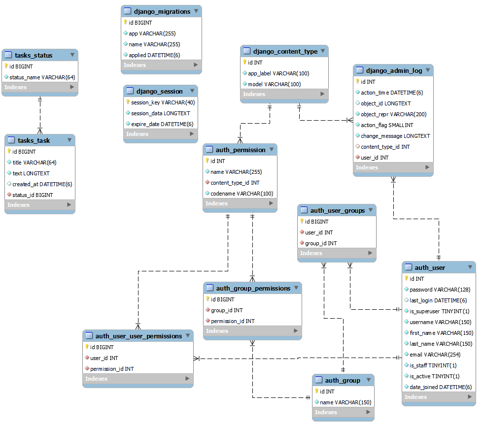

<div id="header" align="center">
    <h1>Привет всем! Я Семен</h1>
    <h3>Python Backend Developer</h3>
</div>
<div id="socials" align="center">
  <a href="https://t.me/Semuk_thededone">
    
  </a>
  <a href="https://leetcode.com/Semuk/">
    
  </a>
</div>

<br>
<div id="languages" align="center">
   <h3>Языки и инструменты</h3>
   &nbsp;
   &nbsp;
   &nbsp;
   &nbsp;
</div>

<br>
<h3 align="center">Установка</h3>

1. Склонируйте репозиторий на свой компьютер:

   ```shell
   git clone <ssh>"
   ```

2. Создайте виртуальное окружение и активируйте его:
   ```shell
   python -m venv venv
   source venv/bin/activate
   ```
   _Примечание: В Windows команда для активации виртуального окружения будет отличаться:_
   ```shell
   venv\Scripts\activate
   ```
   
3. Измените имя файла <template.env> на <.env> и заполните значения ключей.

4. Перейдите в папку проекта Django:

   ```shell
   cd mysite
   ```

5. Примените миграции:

   ```shell
   python manage.py migrate
   ```
   

6. Запуск приложения:

    ```shell
    python manage.py runserver
    ```

### Диаграмма Базы Данных


